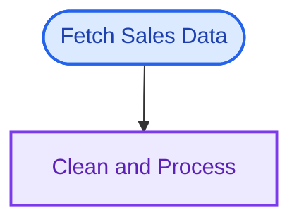
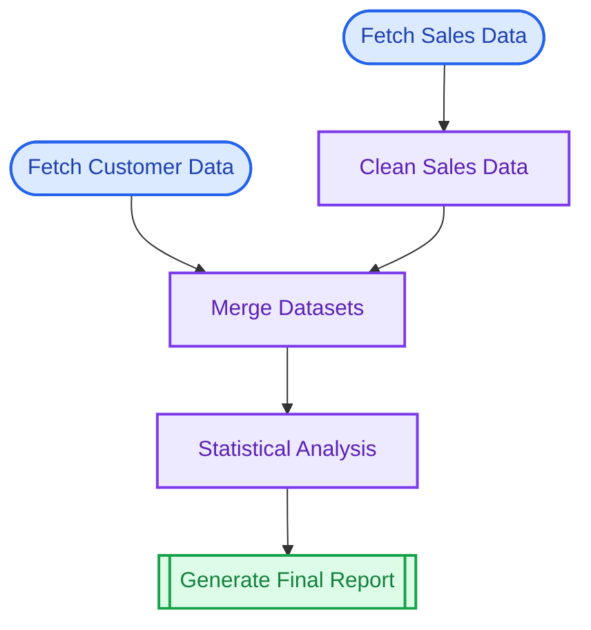
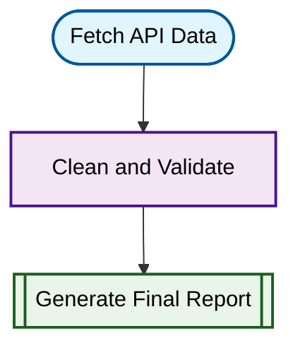
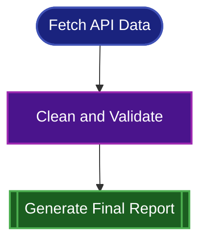
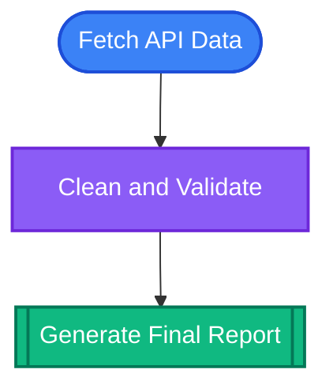
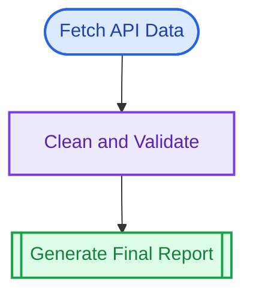
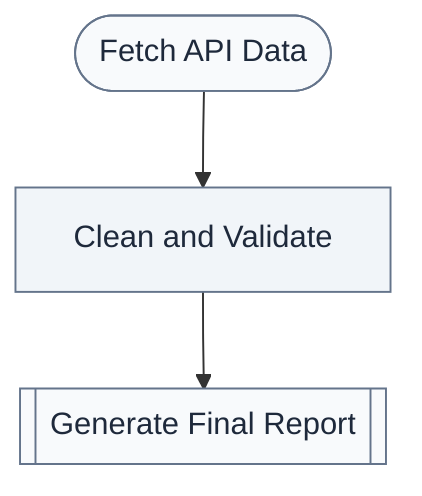

# putior

[](https://github.com/pjt222/putior/actions)
[](https://opensource.org/licenses/MIT)
[](https://lifecycle.r-lib.org/articles/stages.html#experimental)

> **Extract beautiful workflow diagrams from your code annotations**

**putior** (PUT + Input + Output + R) is an R package that extracts structured annotations from source code files and creates beautiful Mermaid flowchart diagrams. Perfect for documenting data pipelines, workflows, and understanding complex codebases.

## 🌟 Key Features

- **Simple annotations** - Add structured comments to your existing code
- **Beautiful diagrams** - Generate professional Mermaid flowcharts
- **File flow tracking** - Automatically connects scripts based on input/output files  
- **Multiple themes** - 5 built-in themes including GitHub-optimized
- **Cross-language support** - Works with R, Python, SQL, shell scripts, and Julia
- **Flexible output** - Console, file, or clipboard export
- **Customizable styling** - Control colors, direction, and node shapes

## 📦 Installation

```r
# Install with devtools
devtools::install_github("pjt222/putior")

# Or with pak (faster)
pak::pkg_install("pjt222/putior")
```

## 🚀 Quick Start

### Step 1: Annotate Your Code

Add structured annotations to your R or Python scripts using `#put` comments:

**`01_fetch_data.R`**
```r
#put id:"fetch_sales", label:"Fetch Sales Data", node_type:"input", output:"sales_data.csv"

# Your actual code
library(readr)
sales_data <- fetch_sales_from_api()
write_csv(sales_data, "sales_data.csv")
```

**`02_clean_data.py`**
```python
#put id:"clean_data", label:"Clean and Process", node_type:"process", input:"sales_data.csv", output:"clean_sales.csv"

import pandas as pd
df = pd.read_csv("sales_data.csv")
# ... data cleaning code ...
df.to_csv("clean_sales.csv")
```

### Step 2: Extract and Visualize

```r
library(putior)

# Extract workflow from your scripts
workflow <- put("./scripts/")

# Generate diagram
put_diagram(workflow)
```

**Result:**


## 📊 Visualization Examples

### Basic Workflow

```r
# Simple three-step process
workflow <- put("./data_pipeline/")
put_diagram(workflow)
```

### Advanced Data Science Pipeline

Here's how putior handles a complete data science workflow:

**File Structure:**
```
data_pipeline/
├── 01_fetch_sales.R      # Fetch sales data
├── 02_fetch_customers.R  # Fetch customer data  
├── 03_clean_sales.py     # Clean sales data
├── 04_merge_data.R       # Merge datasets
├── 05_analyze.py         # Statistical analysis
└── 06_report.R           # Generate final report
```

**Generated Workflow:**


## 📋 Using the Diagrams

### Embedding in Documentation

The generated Mermaid code works perfectly in:

- **GitHub README files** (native Mermaid support)
- **GitLab documentation** 
- **Notion pages**
- **Obsidian notes**
- **Jupyter notebooks** (with extensions)
- **Sphinx documentation** (with plugins)
- **Any Markdown renderer** with Mermaid support

### Saving and Sharing

```r
# Save to markdown file
put_diagram(workflow, output = "file", file = "workflow.md")

# Copy to clipboard for pasting
put_diagram(workflow, output = "clipboard")

# Include title for documentation
put_diagram(workflow, output = "file", file = "docs/pipeline.md", 
           title = "Data Processing Pipeline")
```

## 🎨 Theme System

putior provides 5 carefully designed themes optimized for different environments:

```r
# Get list of available themes
get_diagram_themes()
```

### Theme Overview

| Theme | Best For | Description |
|-------|----------|-------------|
| `light` | Documentation sites, tutorials | Default light theme with bright colors |
| `dark` | Dark mode apps, terminals | Dark theme with muted colors |
| `auto` | GitHub README files | GitHub-adaptive theme that works in both modes |
| `minimal` | Business reports, presentations | Grayscale professional theme |
| `github` | **GitHub README (recommended)** | Optimized for maximum GitHub compatibility |

### Theme Examples

**Light Theme**
```r
put_diagram(workflow, theme = "light")
```


**Dark Theme**
```r
put_diagram(workflow, theme = "dark")
```


**Auto Theme (GitHub Adaptive)**
```r
put_diagram(workflow, theme = "auto")  # Recommended for GitHub!
```


**GitHub Theme (Maximum Compatibility)**
```r
put_diagram(workflow, theme = "github")  # Best for GitHub README
```


**Minimal Theme**
```r
put_diagram(workflow, theme = "minimal")  # Professional documents
```


### When to Use Each Theme

| Theme | Use Case | Environment |
|-------|----------|-------------|
| `light` | Documentation sites, tutorials | Light backgrounds |
| `dark` | Dark mode apps, terminals | Dark backgrounds |
| `auto` | GitHub README files | Adapts automatically |
| `github` | **GitHub README (recommended)** | Maximum compatibility |
| `minimal` | Business reports, presentations | Print-friendly |

### Pro Tips

- **For GitHub**: Use `theme = "github"` for maximum compatibility, or `theme = "auto"` for adaptive colors
- **For Documentation**: Use `theme = "light"` or `theme = "dark"` to match your site
- **For Reports**: Use `theme = "minimal"` for professional, print-friendly diagrams
- **For Demos**: Light theme usually shows colors best in presentations

### Theme Usage Examples

```r
# For GitHub README (recommended)
put_diagram(workflow, theme = "github")

# For GitHub README (adaptive)  
put_diagram(workflow, theme = "auto")

# For dark documentation sites
put_diagram(workflow, theme = "dark", direction = "LR")

# For professional reports
put_diagram(workflow, theme = "minimal", output = "file", file = "report.md")

# Save all themes for comparison
themes <- c("light", "dark", "auto", "github", "minimal")
for(theme in themes) {
  put_diagram(workflow, 
             theme = theme,
             output = "file", 
             file = paste0("workflow_", theme, ".md"),
             title = paste("Workflow -", stringr::str_to_title(theme), "Theme"))
}
```

## 🔧 Customization Options

### Flow Direction

```r
put_diagram(workflow, direction = "TD")  # Top to bottom (default)
put_diagram(workflow, direction = "LR")  # Left to right  
put_diagram(workflow, direction = "BT")  # Bottom to top
put_diagram(workflow, direction = "RL")  # Right to left
```

### Node Labels

```r
put_diagram(workflow, node_labels = "name")   # Show node IDs
put_diagram(workflow, node_labels = "label")  # Show descriptions (default)
put_diagram(workflow, node_labels = "both")   # Show name: description
```

### File Connections

```r
# Show file names on arrows
put_diagram(workflow, show_files = TRUE)

# Clean arrows without file names  
put_diagram(workflow, show_files = FALSE)
```

### Styling Control

```r
# Include colored styling (default)
put_diagram(workflow, style_nodes = TRUE)

# Plain diagram without colors
put_diagram(workflow, style_nodes = FALSE)
```

### Output Options

```r
# Console output (default)
put_diagram(workflow)

# Save to markdown file
put_diagram(workflow, output = "file", file = "my_workflow.md")

# Copy to clipboard for pasting
put_diagram(workflow, output = "clipboard")
```

## 📝 Annotation Reference

### Basic Syntax

All PUT annotations follow this format:
```r
#put property1:"value1", property2:"value2", property3:"value3"
```

### Alternative Formats (All Valid)

```r
#put id:"node_id", label:"Description"              # Standard
# put id:"node_id", label:"Description"             # Space after #
#put| id:"node_id", label:"Description"             # Pipe separator
#put: id:"node_id", label:"Description"             # Colon separator
```

### Required Annotations

| Annotation | Description | Example |
|------------|-------------|---------|
| `id` | Unique identifier for the node | `"fetch_data"`, `"clean_sales"` |
| `label` | Human-readable description | `"Fetch Sales Data"`, `"Clean and Process"` |

### Optional Annotations

| Annotation | Description | Example |
|------------|-------------|---------|
| `node_type` | Visual shape of the node | `"input"`, `"process"`, `"output"`, `"decision"`, `"start"`, `"end"` |
| `input` | Input files (comma-separated) | `"raw_data.csv, config.json"` |
| `output` | Output files (comma-separated) | `"processed_data.csv, summary.txt"` |

### Node Types and Shapes

- **`"input"`** - Data sources, APIs, file readers → Stadium shape `([text])`
- **`"process"`** - Data transformation, analysis → Rectangle `[text]`  
- **`"output"`** - Final results, reports, exports → Subroutine `[[text]]`
- **`"decision"`** - Conditional logic, branching → Diamond `{text}`
- **`"start"`** - Workflow entry point → Stadium shape `([text])`
- **`"end"`** - Workflow termination → Stadium shape `([text])`

### Example Annotations

**R Scripts:**
```r
#put id:"load_sales_data", label:"Load Sales Data from API", node_type:"input", output:"raw_sales.csv, metadata.json"

#put id:"validate_data", label:"Validate and Clean Data", node_type:"process", input:"raw_sales.csv", output:"clean_sales.csv"

#put id:"generate_report", label:"Generate Executive Summary", node_type:"output", input:"clean_sales.csv, metadata.json", output:"executive_summary.pdf"
```

**Python Scripts:**
```python
#put id:"collect_data", label:"Collect Raw Data", node_type:"input", output:"raw_data.csv"

#put id:"train_model", label:"Train ML Model", node_type:"process", input:"features.csv", output:"model.pkl"

#put id:"predict", label:"Generate Predictions", node_type:"output", input:"model.pkl, test_data.csv", output:"predictions.csv"
```

**Multiple Annotations Per File:**
```r
# analysis.R
#put id:"create_summary", label:"Calculate Summary Stats", node_type:"process", input:"processed_data.csv", output:"summary_stats.json"
#put id:"create_report", label:"Generate Sales Report", node_type:"output", input:"processed_data.csv", output:"sales_report.html"

# Your R code here...
```

**Workflow Entry and Exit Points:**
```r
# main_workflow.R
#put id:"workflow_start", label:"Start Analysis Pipeline", node_type:"start", output:"config.json"

#put id:"workflow_end", label:"Pipeline Complete", node_type:"end", input:"final_report.pdf"
```

### Supported File Types

putior automatically detects and processes these file types:
- **R**: `.R`, `.r`
- **Python**: `.py`
- **SQL**: `.sql`
- **Shell**: `.sh`
- **Julia**: `.jl`

## 🛠️ Advanced Usage

### Directory Scanning

```r
# Scan current directory
workflow <- put(".")

# Scan specific directory
workflow <- put("./src/")

# Recursive scanning (include subdirectories)
workflow <- put("./project/", recursive = TRUE)

# Custom file patterns
workflow <- put("./analysis/", pattern = "\\.(R|py)$")

# Single file
workflow <- put("./script.R")
```

### Debugging and Validation

```r
# Include line numbers for debugging
workflow <- put("./src/", include_line_numbers = TRUE)

# Disable validation warnings  
workflow <- put("./src/", validate = FALSE)

# Test annotation syntax
is_valid_put_annotation('#put id:"test", label:"Test Node"')  # TRUE
is_valid_put_annotation("#put invalid syntax")                 # FALSE
```

## 🤝 Contributing

Contributions welcome! Please open an issue or pull request on [GitHub](https://github.com/pjt222/putior).

**Development Setup:**
```bash
git clone https://github.com/pjt222/putior.git
cd putior

# Install dev dependencies  
Rscript -e "devtools::install_dev_deps()"

# Run tests
Rscript -e "devtools::test()"

# Check package
Rscript -e "devtools::check()"
```

## 📄 License

This project is licensed under the MIT License - see the [LICENSE](LICENSE) file for details.

## 🙏 Acknowledgments

- Built with [Mermaid](https://mermaid-js.github.io/) for beautiful diagram generation
- Inspired by the need for better code documentation and workflow visualization
- Thanks to the R community for excellent development tooling

---

**Made with ❤️ for the R and Python communities**