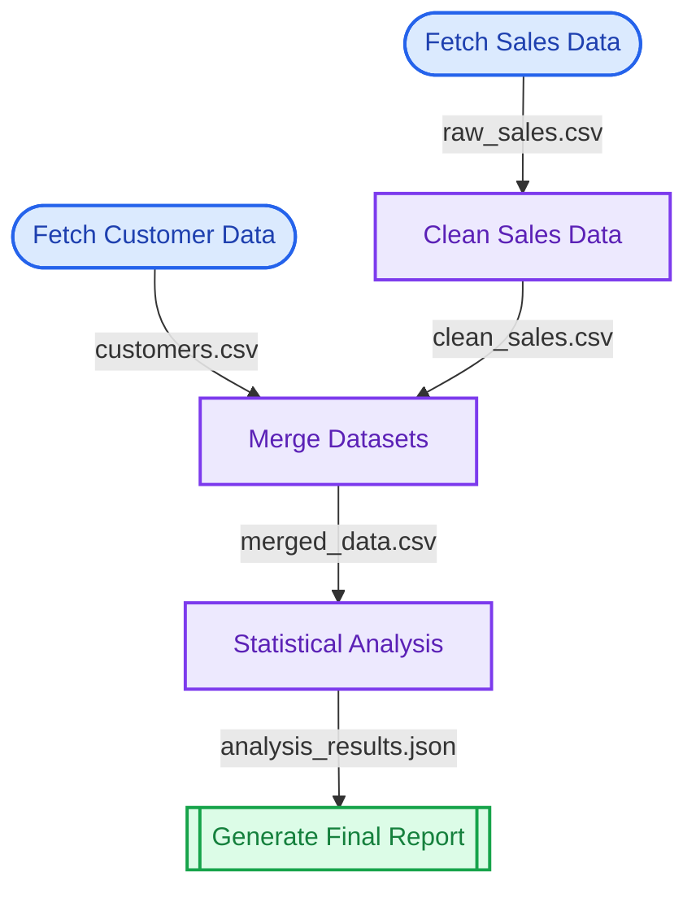

# putior

[](https://github.com/pjt222/putior/actions)
[](https://opensource.org/licenses/MIT)
[](https://lifecycle.r-lib.org/articles/stages.html#experimental)

> **Extract beautiful workflow diagrams from your code annotations**

Turn your R and Python scripts into stunning visual workflows with simple annotations. Perfect for documentation, presentations, and understanding complex data pipelines.

## 🌟 Features

- **Simple Annotations** - Add `#' @put` comments to your code
- **Beautiful Diagrams** - Generate professional Mermaid flowcharts  
- **Multiple Themes** - 5 built-in themes including GitHub-optimized
- **File Flow Tracking** - Automatically connects scripts based on input/output files
- **Multiple Outputs** - Console, file, or clipboard export
- **Cross-Language** - Works with R, Python, and more

## 📦 Installation

```r
# Install from GitHub
devtools::install_github("pjt222/putior")

# Or with pak (faster)
pak::pkg_install("pjt222/putior")

# Or with remotes
remotes::install_github("pjt222/putior")
```

## 🚀 Quick Start

### 1. Annotate Your Code

Add simple annotations to your R or Python scripts:

**`01_load_data.R`**
```r
#' @put name: fetch_sales
#' @put label: Fetch Sales Data  
#' @put node_type: input
#' @put output: raw_sales.csv

library(readr)
sales_data <- read_csv("database_export.csv")
write_csv(sales_data, "raw_sales.csv")
```

**`02_process_data.py`**
```python
# @put name: clean_data
# @put label: Clean and Process
# @put node_type: process  
# @put input: raw_sales.csv
# @put output: processed_sales.csv

import pandas as pd
df = pd.read_csv("raw_sales.csv")
# ... cleaning code ...
df.to_csv("processed_sales.csv")
```

### 2. Generate Your Workflow

```r
library(putior)

# Extract workflow from your scripts
workflow <- put("./scripts/")

# Create beautiful diagram
put_diagram(workflow, theme = "github")
```

### 3. Get Beautiful Results


## 📊 Advanced Example

Here's how putior handles a complete data science workflow:

```r
# Extract workflow from multiple files
workflow <- put("./data_pipeline/")

# Create comprehensive diagram with file connections
put_diagram(workflow, 
           theme = "github",
           show_files = TRUE,
           direction = "TD")
```

**Generated Workflow:**


## 🎨 Themes

Choose from 5 beautiful themes optimized for different environments:

| Theme | Best For | Description |
|-------|----------|-------------|
| `github` | **GitHub README** | Maximum compatibility and contrast |
| `light` | Documentation sites | Bright colors with dark text |
| `dark` | Dark mode environments | Muted colors with light text |
| `auto` | Adaptive documents | Works in both light/dark modes |
| `minimal` | Business reports | Professional grayscale |

```r
# GitHub-optimized (recommended for README)
put_diagram(workflow, theme = "github")

# Professional minimal theme
put_diagram(workflow, theme = "minimal", 
           output = "file", file = "workflow.md")

# Dark theme for terminals
put_diagram(workflow, theme = "dark", direction = "LR")
```

## 🔧 Customization Options

### Direction Control
```r
put_diagram(workflow, direction = "LR")  # Left to right
put_diagram(workflow, direction = "TD")  # Top to bottom (default)
put_diagram(workflow, direction = "BT")  # Bottom to top
put_diagram(workflow, direction = "RL")  # Right to left
```

### Output Options
```r
# Console output (default)
put_diagram(workflow)

# Save to file
put_diagram(workflow, output = "file", file = "my_workflow.md")

# Copy to clipboard
put_diagram(workflow, output = "clipboard")
```

### Node Labels
```r
put_diagram(workflow, node_labels = "name")   # Show function names
put_diagram(workflow, node_labels = "label")  # Show descriptions (default)
put_diagram(workflow, node_labels = "both")   # Show both
```

### File Connections
```r
# Show file names on connections
put_diagram(workflow, show_files = TRUE)

# Hide file names (cleaner look)
put_diagram(workflow, show_files = FALSE)
```

## 📋 Annotation Reference

| Annotation | Description | Example |
|------------|-------------|---------|
| `name` | Unique identifier | `fetch_data` |
| `label` | Display name | `Fetch Sales Data` |
| `node_type` | Visual shape | `input`, `process`, `output`, `decision` |
| `input` | Input files | `raw_data.csv, config.json` |
| `output` | Output files | `processed_data.csv` |

### Node Types
- **`input`** - Data sources, APIs, file readers (stadium shape)
- **`process`** - Data transformation, analysis (rectangle) 
- **`output`** - Final results, reports, exports (subroutine shape)
- **`decision`** - Conditional logic, branching (diamond)

## 🤝 Contributing

Contributions are welcome! Please see our [contribution guidelines](CONTRIBUTING.md).

**Development Setup:**
```bash
# Clone the repository
git clone https://github.com/pjt222/putior.git
cd putior

# Install development dependencies
Rscript -e "devtools::install_dev_deps()"

# Run tests
Rscript -e "devtools::test()"

# Check package
Rscript -e "devtools::check()"
```

## 📄 License

This project is licensed under the MIT License - see the [LICENSE](LICENSE) file for details.

## 🙏 Acknowledgments

- Built with [Mermaid](https://mermaid-js.github.io/) for diagram generation
- Inspired by the need for better code documentation
- Thanks to the R community for excellent tooling

---

**Made with ❤️ for the R and Python communities**