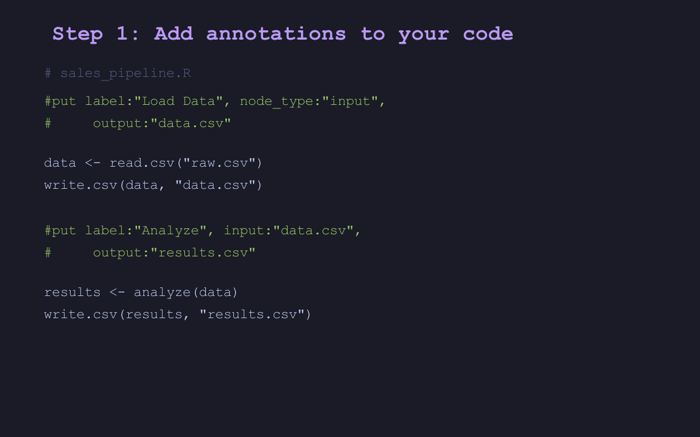
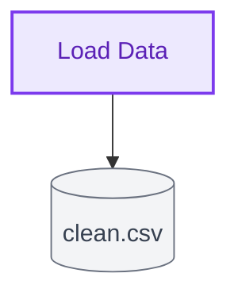
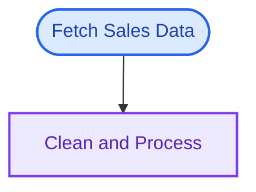
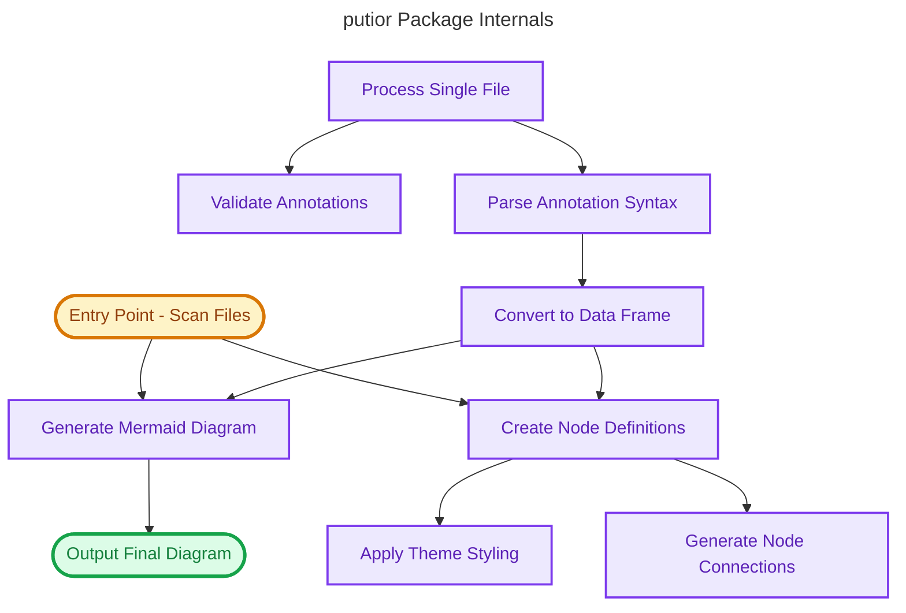

# putior 

[](https://github.com/pjt222/putior/actions)
[](https://CRAN.R-project.org/package=putior)
[](https://cran.r-project.org/package=putior)
[](https://opensource.org/licenses/MIT)
[](https://lifecycle.r-lib.org/articles/stages.html#stable)
[](https://pjt222.github.io/putior/articles/quick-reference.html)
[](https://github.com/sponsors/pjt222)

> **Extract beautiful workflow diagrams from your code annotations**



**putior** (PUT + Input + Output + R) extracts structured annotations from source code and generates Mermaid flowchart diagrams. Document data pipelines, visualize workflows, and understand complex codebases -- across 30+ programming languages.

## TL;DR

```r
# 1. Add annotation to your script
# put label:"Load Data", output:"clean.csv"

# 2. Generate diagram
library(putior)
put_diagram(put("./"))
```

<details>
<summary>See result</summary>


```mermaid
flowchart TD
    node1[Load Data]
    artifact_clean_csv[(clean.csv)]
    node1 --> artifact_clean_csv
    classDef processStyle fill:#ede9fe,stroke:#7c3aed,stroke-width:2px,color:#5b21b6
    class node1 processStyle
    classDef artifactStyle fill:#f3f4f6,stroke:#6b7280,stroke-width:1px,color:#374151
    class artifact_clean_csv artifactStyle
```

</details>

## Key Features

- **Simple annotations** -- one-line comments in your existing code (`# put label:"..."`)
- **Beautiful Mermaid diagrams** -- 9 built-in themes including colorblind-safe viridis family
- **30+ language support** -- R, Python, SQL, JavaScript, TypeScript, Go, Rust, and more with automatic comment syntax detection
- **Auto-detection** -- `put_auto()` analyzes code without annotations; `put_generate()` creates annotation skeletons; `put_merge()` combines both
- **Lightweight** -- only depends on `tools` (base R)

## Installation

```r
# Install from CRAN (recommended)
install.packages("putior")

# Or install from GitHub (development version)
remotes::install_github("pjt222/putior")

# Or with renv
renv::install("putior")  # CRAN version
renv::install("pjt222/putior")  # GitHub version

# Or with pak (faster)
pak::pkg_install("putior")  # CRAN version
pak::pkg_install("pjt222/putior")  # GitHub version
```

## Example: Multi-Language Data Pipeline

putior connects scripts across languages by tracking input and output files:

**`01_fetch.R`**
```r
# put id:"fetch", label:"Fetch Sales Data", node_type:"input", output:"raw_sales.csv"
sales <- fetch_sales_from_api()
write.csv(sales, "raw_sales.csv")
```

**`02_clean.py`**
```python
# put id:"clean", label:"Clean and Validate", input:"raw_sales.csv", output:"clean_sales.csv"
import pandas as pd
df = pd.read_csv("raw_sales.csv")
df.dropna().to_csv("clean_sales.csv")
```

**`03_report.sql`**
```sql
-- put id:"report", label:"Generate Summary", node_type:"output", input:"clean_sales.csv"
SELECT region, SUM(amount) FROM clean_sales GROUP BY region;
```

**Generate the diagram:**
```r
library(putior)
workflow <- put("./pipeline/")
put_diagram(workflow, theme = "github")
```

**Result:**

```mermaid
flowchart TD
    fetch_sales(["Fetch Sales Data"])
    clean_data["Clean and Process"]

    %% Connections
    fetch_sales --> clean_data

    %% Styling
    classDef inputStyle fill:#dbeafe,stroke:#2563eb,stroke-width:2px,color:#1e40af
    class fetch_sales inputStyle
    classDef processStyle fill:#ede9fe,stroke:#7c3aed,stroke-width:2px,color:#5b21b6
    class clean_data processStyle
```

## Learn More

Explore the full documentation at the [pkgdown site](https://pjt222.github.io/putior/).

### Getting Started

| Guide | Description |
|-------|-------------|
| [Quick Start](https://pjt222.github.io/putior/articles/quick-start.html) | First diagram in 2 minutes |
| [Annotation Guide](https://pjt222.github.io/putior/articles/annotation-guide.html) | Complete syntax reference, multiline annotations, best practices |

### Going Deeper

| Guide | Description |
|-------|-------------|
| [Features Tour](https://pjt222.github.io/putior/articles/features-tour.html) | Auto-detection, themes, logging, interactive diagrams |
| [Showcase](https://pjt222.github.io/putior/articles/showcase.html) | Real-world examples (ETL, ML, bioinformatics, finance) |

### Reference

| Guide | Description |
|-------|-------------|
| [API Reference](https://pjt222.github.io/putior/articles/api-reference.html) | Complete function documentation |
| [Quick Reference](https://pjt222.github.io/putior/articles/quick-reference.html) | At-a-glance reference card |
| [Troubleshooting](https://pjt222.github.io/putior/articles/troubleshooting.html) | Common issues and solutions |
| [AI Skills](https://pjt222.github.io/putior/articles/skills.html) | MCP/ACP integration for AI assistants |

## How putior Compares

putior fills a unique niche by combining annotation-based workflow extraction with Mermaid diagram generation:

| Package | Focus | Approach | Output | Best For |
|---------|-------|----------|--------|----------|
| **putior** | **Data workflow visualization** | **Code annotations** | **Mermaid diagrams** | **Pipeline documentation** |
| [CodeDepends](https://cran.r-project.org/package=CodeDepends) | Code dependency analysis | Static analysis | Variable graphs | Understanding code structure |
| [DiagrammeR](https://cran.r-project.org/package=DiagrammeR) | General diagramming | Manual diagram code | Interactive graphs | Custom diagrams |
| [visNetwork](https://cran.r-project.org/package=visNetwork) | Interactive networks | Manual network definition | Interactive vis.js | Complex network exploration |
| [dm](https://cran.r-project.org/package=dm) | Database relationships | Schema analysis | ER diagrams | Database documentation |
| [flowchart](https://cran.r-project.org/package=flowchart) | Study flow diagrams | Dataframe input | ggplot2 charts | Clinical trials |

### Documentation vs Execution

A common question: *"How does putior relate to targets/drake/Airflow?"*

putior *documents* workflows; targets/drake/Airflow *execute* them. They are complementary -- you can annotate a targets pipeline with `# put` comments and use putior to generate visual documentation for your README or wiki.

| Tool | Purpose | Relationship to putior |
|------|---------|------------------------|
| **putior** | Document and visualize workflows | -- |
| [targets](https://cran.r-project.org/package=targets) | Execute R pipelines | putior can document targets pipelines |
| [drake](https://cran.r-project.org/package=drake) | Execute R pipelines (predecessor to targets) | putior can document drake plans |
| [Airflow](https://airflow.apache.org/) | Orchestrate complex DAGs | putior can document Airflow DAGs |
| [Nextflow](https://www.nextflow.io/) | Execute bioinformatics pipelines | putior can document Nextflow workflows |

## Self-Documentation

putior uses its own annotation system to document its internal workflow -- a real demonstration of the package in action. Running `put("./R/")` on putior's own source code produces this diagram:


```mermaid
---
title: putior Package Internals
---
flowchart TD
    diagram_gen[Generate Mermaid Diagram]
    styling[Apply Theme Styling]
    node_defs[Create Node Definitions]
    connections[Generate Node Connections]
    output_handler([Output Final Diagram])
    put_entry([Entry Point - Scan Files])
    process_file[Process Single File]
    validate[Validate Annotations]
    parser[Parse Annotation Syntax]
    convert_df[Convert to Data Frame]

    %% Connections
    put_entry --> diagram_gen
    convert_df --> diagram_gen
    node_defs --> styling
    put_entry --> node_defs
    convert_df --> node_defs
    node_defs --> connections
    diagram_gen --> output_handler
    process_file --> validate
    process_file --> parser
    parser --> convert_df

    %% Styling
    classDef processStyle fill:#ede9fe,stroke:#7c3aed,stroke-width:2px,color:#5b21b6
    class diagram_gen processStyle
    class styling processStyle
    class node_defs processStyle
    class connections processStyle
    class process_file processStyle
    class validate processStyle
    class parser processStyle
    class convert_df processStyle
    classDef startStyle fill:#fef3c7,stroke:#d97706,stroke-width:3px,color:#92400e
    class put_entry startStyle
    classDef endStyle fill:#dcfce7,stroke:#16a34a,stroke-width:3px,color:#15803d
    class output_handler endStyle
```

## Contributing

Contributions welcome! Please open an issue or pull request on [GitHub](https://github.com/pjt222/putior).

```bash
git clone https://github.com/pjt222/putior.git
cd putior
Rscript -e "devtools::install_dev_deps()"
Rscript -e "devtools::test()"
Rscript -e "devtools::check()"
```

## License

This project is licensed under the MIT License -- see the [LICENSE](LICENSE) file for details.

## Acknowledgments

### Contributors

- **Philipp Thoss** ([@pjt222](https://github.com/pjt222)) -- Primary author and maintainer
- **Claude** (Anthropic) -- Co-author on 38 commits, contributing to package development, documentation, and testing

*While GitHub's contributor graph only displays primary commit authors, Claude's contributions are attributed through Co-Authored-By tags. See: `git log --grep="Co-Authored-By: Claude"`*

### Related Packages

- **[CodeDepends](https://cran.r-project.org/package=CodeDepends)** -- R code dependency analysis
- **[targets](https://cran.r-project.org/package=targets)** -- pipeline toolkit for reproducible computation
- **[DiagrammeR](https://cran.r-project.org/package=DiagrammeR)** -- graph visualization in R
- **[ggraph](https://cran.r-project.org/package=ggraph)** -- grammar of graphics for networks
- **[visNetwork](https://cran.r-project.org/package=visNetwork)** -- interactive network visualization
- **[dm](https://cran.r-project.org/package=dm)** -- relational data model visualization
- **[flowchart](https://cran.r-project.org/package=flowchart)** -- participant flow diagrams
- **[igraph](https://cran.r-project.org/package=igraph)** -- network analysis foundation

Built with [Mermaid](https://mermaid-js.github.io/) for diagram generation.

---

**Made for polyglot data science workflows across R, Python, Julia, SQL, JavaScript, Go, Rust, and 30+ languages**
