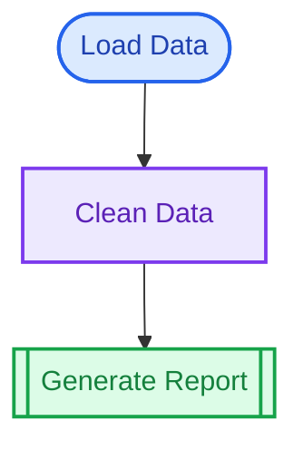

# Quick Start

### Your First Diagram in 2 Minutes

#### Step 1: Install

``` r
install.packages("putior")
```

``` r
library(putior)
```

#### Step 2: Add Annotations to Your Code

Add `# put` comments to your R scripts:

``` r
# my_analysis.R
# put label:"Load Data", output:"raw_data"
data <- read.csv("sales.csv")

# put label:"Clean Data", input:"raw_data", output:"clean_data"
clean <- data[complete.cases(data), ]

# put label:"Generate Report", input:"clean_data", output:"report.html"
rmarkdown::render("report.Rmd")
```

#### Step 3: Generate Diagram

``` r
workflow <- put("my_analysis.R")
put_diagram(workflow)
```

That’s it! You’ll see a flowchart like this:



------------------------------------------------------------------------

### Try It Now

``` r
# Create a temporary file with annotations
temp_file <- tempfile(fileext = ".R")
writeLines(c(
  '# put label:"Extract", output:"raw.csv"',
  'data <- read.csv("source.csv")',
  '',
  '# put label:"Transform", input:"raw.csv", output:"clean.csv"',
  'clean <- transform(data)',
  '',
  '# put label:"Load", input:"clean.csv", output:"database"',
  'write_to_db(clean)'
), temp_file)

# Scan and visualize
workflow <- put(temp_file)
#> Warning: Validation issues in file238f26299bb7.R line 7:
#> File reference missing extension: database
```

``` r
cat("```mermaid\n")
```

``` mermaid
``` r
cat(put_diagram(workflow, output = "raw"))
```

flowchart TD node_423c4c79_b1e7_4a51_b84c_d954cdd48449\[“Extract”\]
node_7d115a41_3952_4e0c_baa0_9bffd9c65f3c\[“Transform”\]
fd2293d6_413e_4065_b04f_8cdbcca9bafe\[“Load”\]

    %% Connections
    node_423c4c79_b1e7_4a51_b84c_d954cdd48449 --> node_7d115a41_3952_4e0c_baa0_9bffd9c65f3c
    node_7d115a41_3952_4e0c_baa0_9bffd9c65f3c --> fd2293d6_413e_4065_b04f_8cdbcca9bafe

``` r
cat("\n```\n")
```

## Cleanup

unlink(temp_file)

    ---
    ## Annotation Syntax at a Glance

## put label:“Step Name”, input:“file.csv”, output:“result.csv”

    | Field | Purpose | Required |
    |-------|---------|----------|
    | `label` | Human-readable name | Yes |
    | `input` | Files/data consumed | No |
    | `output` | Files/data produced | No |
    | `id` | Unique identifier | No (auto-generated) |
    | `node_type` | `input`, `process`, `output` | No (defaults to `process`) |

    **Multiple inputs/outputs:** Use commas: `input:"a.csv, b.csv"`

    ---

    ## Multi-Language Support

    putior works with 30+ languages. Comment prefix is auto-detected:

    | Language | Annotation |
    |----------|------------|
    | R, Python, Shell | `# put label:"..."` |
    | SQL, Lua | `-- put label:"..."` |
    | JavaScript, Go, Rust | `// put label:"..."` |
    | MATLAB | `% put label:"..."` |

    ---

    ## Common Patterns

    ### Scan a Directory

    ``` r
    workflow <- put("./src/")
    put_diagram(workflow)

#### Include Subdirectories

``` r
workflow <- put("./project/", recursive = TRUE)
```

#### Auto-Detect Workflow (No Annotations!)

``` r
# Automatically detect file I/O from code
workflow <- put_auto("./src/")
put_diagram(workflow)
```

#### Choose a Theme

``` r
put_diagram(workflow, theme = "github")  # or: light, dark, minimal, viridis
```

#### Save to File

``` r
put_diagram(workflow, output = "file", file = "workflow.md")
```

------------------------------------------------------------------------

### Interactive Sandbox

Experiment without creating files:

``` r
run_sandbox()  # Opens Shiny app
```

------------------------------------------------------------------------

### What’s Next?

| Guide                                                                            | When to Read                                                     |
|----------------------------------------------------------------------------------|------------------------------------------------------------------|
| [Annotation Guide](https://pjt222.github.io/putior/articles/annotation-guide.md) | Complete syntax reference, multiline annotations, best practices |
| [Quick Reference](https://pjt222.github.io/putior/articles/quick-reference.md)   | Printable cheat sheet for daily use                              |
| [Features Tour](https://pjt222.github.io/putior/articles/features-tour.md)       | Auto-detection, logging, interactive diagrams, metadata display  |
| [API Reference](https://pjt222.github.io/putior/articles/api-reference.md)       | All functions and parameters                                     |
| [Showcase](https://pjt222.github.io/putior/articles/showcase.md)                 | Real-world examples (ETL, ML pipelines, bioinformatics)          |
| [Troubleshooting](https://pjt222.github.io/putior/articles/troubleshooting.md)   | Common issues and solutions                                      |

------------------------------------------------------------------------

### Quick Reference

``` r
# Core functions
put(path)                    # Extract annotations
put_diagram(workflow)        # Generate Mermaid diagram
put_auto(path)               # Auto-detect workflow (no annotations)
put_generate(path)           # Generate annotation suggestions

# Useful options
put("./", recursive = TRUE)  # Include subdirectories
put_diagram(wf, theme = "github", direction = "LR")
put_diagram(wf, show_artifacts = FALSE)  # Hide data files
```

**Need help?** Run
[`?put`](https://pjt222.github.io/putior/reference/put.md) or
[`?put_diagram`](https://pjt222.github.io/putior/reference/put_diagram.md)
for full documentation.
