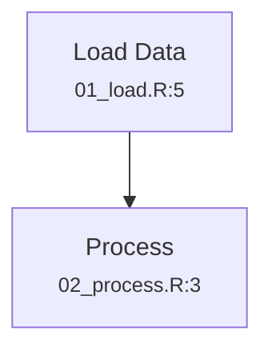
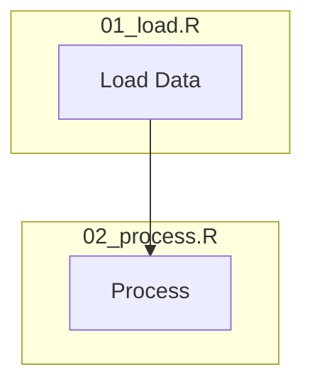

```{r, include = FALSE}
knitr::opts_chunk$set(
  collapse = TRUE,
  comment = "#>",
  eval = FALSE
)
```

This guide tours the advanced features of putior that go beyond basic annotation extraction. Learn how to auto-detect workflows, create interactive diagrams, customize detection patterns, and more.

## Feature Overview

| Feature | Purpose | Key Functions |
|---------|---------|---------------|
| Auto-Annotation | Detect workflows without writing annotations | `put_auto()`, `put_generate()`, `put_merge()` |
| Interactive Diagrams | Clickable nodes, source info display | `enable_clicks`, `show_source_info` |
| Detection Patterns | View/customize what gets detected | `get_detection_patterns()` |
| Interactive Sandbox | Experiment without writing files | `run_sandbox()` |
| Structured Logging | Debug annotation parsing | `set_putior_log_level()` |
| Themes & Styling | Customize diagram appearance | `theme`, `style_nodes` |

---

## Auto-Annotation System

The auto-annotation system analyzes your code to detect workflow elements automatically, similar to how roxygen2 generates documentation skeletons.

### Why Auto-Annotation?

- **Instant visualization**: See data flow in unfamiliar codebases immediately
- **Annotation templates**: Generate starting points for manual annotations
- **Hybrid workflows**: Combine manual control with auto-detection for completeness
- **Project onboarding**: Help new team members understand code quickly

### `put_auto()` - Detect Workflow Automatically

Analyzes source code patterns to detect file inputs, outputs, and dependencies without requiring any annotations.

```{r}
library(putior)

# Auto-detect workflow from code patterns
workflow <- put_auto("./src/")

# View what was detected
print(workflow)

# Generate diagram
put_diagram(workflow)
```

**What Gets Detected:**

For R code:
- **Inputs**: `read.csv()`, `read_csv()`, `readRDS()`, `load()`, `fread()`, `read_excel()`, `fromJSON()`, `read_parquet()`, database connections, etc.
- **Outputs**: `write.csv()`, `saveRDS()`, `ggsave()`, `write_parquet()`, database writes, etc.
- **Dependencies**: `source()`, `sys.source()`

For Python code:
- **Inputs**: `pd.read_csv()`, `json.load()`, `pickle.load()`, database connections, etc.
- **Outputs**: `df.to_csv()`, `json.dump()`, `plt.savefig()`, database writes, etc.

**Control Detection:**

```{r}
# Only detect inputs and outputs (skip dependencies)
workflow <- put_auto("./src/", detect_dependencies = FALSE)

# Only detect outputs
workflow <- put_auto("./src/", detect_inputs = FALSE, detect_dependencies = FALSE)
```

### `put_generate()` - Generate Annotation Comments

Creates PUT annotation comments that you can add to your source files. Think of it like roxygen2's skeleton generation.

```{r}
# Print suggested annotations to console
put_generate("./src/")
```

**Example Output:**

```
# For file: process_data.R
#put id:"process_data", label:"Process Data", node_type:"process", input:"raw_data.csv", output:"clean_data.csv"

# For file: analyze.R
#put id:"analyze", label:"Analyze", node_type:"process", input:"clean_data.csv", output:"results.json"
```

**Copy to Clipboard:**

```{r}
# Copy annotations to clipboard for pasting
put_generate("./src/", output = "clipboard")
```

**Annotation Styles:**

```{r}
# Single-line style (default)
put_generate("./src/", style = "single")
# Output: #put id:"step1", label:"Step 1", input:"a.csv", output:"b.csv"

# Multiline style for complex annotations
put_generate("./src/", style = "multiline")
# Output:
# #put id:"step1", \
# #     label:"Step 1", \
# #     input:"a.csv", \
# #     output:"b.csv"
```

### `put_merge()` - Combine Manual + Auto

Combines your manual annotations with auto-detected ones using configurable merge strategies.

```{r}
# Manual annotations take priority
workflow <- put_merge("./src/", merge_strategy = "manual_priority")

# Auto fills in missing input/output fields
workflow <- put_merge("./src/", merge_strategy = "supplement")

# Combine all I/O from both sources
workflow <- put_merge("./src/", merge_strategy = "union")
```

**When to Use Each Strategy:**

| Strategy | Use Case |
|----------|----------|
| `manual_priority` | You want full control, auto only adds missing files |
| `supplement` | Your annotations have labels but missing I/O details |
| `union` | You want the most complete picture possible |

### Auto-Annotation Workflow

```
Source Files ──┬──> put()      ──> Manual Annotations ─┬─> put_merge() ──> put_diagram()
               │                                       │
               └──> put_auto() ──> Auto Annotations  ──┘
```

**Typical Usage Pattern:**

```{r}
# 1. Start with auto-detection to understand code
auto <- put_auto("./new_project/")
put_diagram(auto)

# 2. Generate annotation templates
put_generate("./new_project/", output = "clipboard")
# Paste into files and customize

# 3. Use merged workflow for complete picture
final <- put_merge("./new_project/", merge_strategy = "supplement")
put_diagram(final, output = "file", file = "workflow.md")
```

---

## Interactive Diagrams

Make your diagrams more useful with source file information and clickable nodes.

### `show_source_info` - Display File Information

Show which source file each workflow node comes from.

```{r}
workflow <- put("./src/", include_line_numbers = TRUE)

# Inline style - shows file name below node label
put_diagram(workflow, show_source_info = TRUE)
```

**Output:**


**Subgraph Style:**

Group nodes by source file using subgraphs:

```{r}
put_diagram(workflow,
            show_source_info = TRUE,
            source_info_style = "subgraph")
```

**Output:**


### `enable_clicks` - Clickable Nodes

Make diagram nodes clickable to open the source file directly in your editor.

```{r}
workflow <- put("./src/", include_line_numbers = TRUE)

# Enable clicks with VS Code protocol
put_diagram(workflow, enable_clicks = TRUE)

# Use RStudio protocol
put_diagram(workflow, enable_clicks = TRUE, click_protocol = "rstudio")

# Use standard file:// protocol
put_diagram(workflow, enable_clicks = TRUE, click_protocol = "file")
```

**Supported Protocols:**

| Protocol | URL Format | Use With |
|----------|------------|----------|
| `vscode` | `vscode://file/path:line` | VS Code, Cursor |
| `rstudio` | `rstudio://open-file?path=` | RStudio IDE |
| `file` | `file:///path` | System default |

**Combined Interactive Features:**

```{r}
put_diagram(workflow,
            show_source_info = TRUE,      # Show file names
            source_info_style = "inline",  # Inline display
            enable_clicks = TRUE,          # Make clickable
            click_protocol = "vscode")     # Open in VS Code
```

---

## Detection Patterns

View and understand the patterns putior uses to auto-detect inputs and outputs.

### `get_detection_patterns()` - View Patterns

```{r}
# Get all R patterns
r_patterns <- get_detection_patterns("r")
names(r_patterns)
#> [1] "input"      "output"     "dependency"

# Get only input patterns for R
input_patterns <- get_detection_patterns("r", type = "input")
length(input_patterns)
#> [1] 58  # R has 58 input patterns!

# View a specific pattern
input_patterns[[1]]
#> $regex
#> [1] "read\\.csv\\s*\\("
#> $func
#> [1] "read.csv"
#> $arg_position
#> [1] 1
#> $arg_name
#> [1] "file"
#> $description
#> [1] "Base R CSV reader"
```

### Supported Languages

```{r}
# All languages with annotation support
list_supported_languages()
#> [1] "r"          "python"     "shell"      "julia"      "ruby"
#> [6] "perl"       "yaml"       "toml"       "sql"        "lua"
#> [11] "haskell"   "javascript" "typescript" "c"          "cpp"
#> [16] "java"      "go"         "rust"       "swift"      "kotlin"
#> [21] "csharp"    "php"        "scala"      "matlab"     "latex"

# Languages with auto-detection patterns
list_supported_languages(detection_only = TRUE)
#> [1] "r"      "python" "sql"    "shell"  "julia"

# Get comment prefix for any extension
get_comment_prefix("sql")
#> [1] "--"
get_comment_prefix("js")
#> [1] "//"
get_comment_prefix("m")
#> [1] "%"
```

### Pattern Categories

**R Patterns Include:**

| Category | Examples |
|----------|----------|
| Base R | `read.csv`, `write.csv`, `saveRDS`, `load` |
| tidyverse | `read_csv`, `write_csv`, `read_rds` |
| data.table | `fread`, `fwrite` |
| Excel | `read_excel`, `read_xlsx`, `write_xlsx` |
| JSON | `fromJSON`, `toJSON`, `read_json` |
| Parquet/Arrow | `read_parquet`, `write_parquet` |
| Database | `dbConnect`, `dbReadTable`, `dbWriteTable` |
| Graphics | `ggsave`, `pdf`, `png`, `jpeg` |
| Statistical | `read_sav`, `read_sas`, `read_dta` |

**Python Patterns Include:**

| Category | Examples |
|----------|----------|
| pandas | `pd.read_csv`, `.to_csv`, `.to_parquet` |
| Built-in | `open()`, `json.load`, `pickle.load` |
| numpy | `np.load`, `np.save`, `np.savetxt` |
| matplotlib | `plt.savefig` |
| polars | `pl.read_csv`, `.write_csv` |
| Database | `create_engine`, `cursor.execute` |

---

## Interactive Sandbox

The sandbox is a Shiny app for experimenting with PUT annotations without creating files.

### Launch the Sandbox

```{r}
run_sandbox()
```

### Sandbox Features

1. **Code Editor**: Paste or type annotated code with syntax highlighting (requires `shinyAce`)

2. **Multi-file Simulation**: Use special markers to simulate multiple files:
```r
# ===== File: 01_load.R =====
#put label:"Load Data", node_type:"input", output:"data.csv"
data <- read.csv("source.csv")

# ===== File: 02_process.R =====
#put label:"Process", input:"data.csv", output:"results.csv"
# Processing code here
```

3. **Real-time Preview**: See diagram updates as you edit

4. **Customization Options**:
   - Theme selection (github, light, dark, etc.)
   - Direction (TD, LR, BT, RL)
   - Show/hide artifacts
   - Show/hide file names
   - Workflow boundaries toggle

5. **Export Options**:
   - Download as Markdown file
   - Copy Mermaid code to clipboard
   - View extracted workflow data

### Sandbox Use Cases

- **Learning**: Experiment with annotation syntax
- **Prototyping**: Design workflows before writing code
- **Debugging**: Test why annotations aren't working
- **Demos**: Show putior capabilities without setup

---

## Debugging with Logging

putior includes optional structured logging via the `logger` package.

### Enable Logging

```{r}
# Install logger if needed
install.packages("logger")

# Set log level
set_putior_log_level("DEBUG")

# Now all putior functions will log detailed information
workflow <- put("./src/")
```

### Log Levels

| Level | What You See |
|-------|--------------|
| `DEBUG` | Every operation: file scans, pattern matches, parsing steps |
| `INFO` | Progress milestones: scan started, nodes found, diagram complete |
| `WARN` | Issues that don't stop execution: validation warnings |
| `ERROR` | Fatal issues only |

### Per-Call Override

```{r}
# Override for a single call without changing global setting
workflow <- put("./src/", log_level = "DEBUG")
put_diagram(workflow, log_level = "INFO")
```

### Debugging Scenarios

**Why isn't my annotation found?**
```{r}
set_putior_log_level("DEBUG")
workflow <- put("./problem_file.R", include_line_numbers = TRUE)
# Check logs for pattern matching details
```

**Why are nodes not connected?**
```{r}
set_putior_log_level("INFO")
put_diagram(workflow, show_artifacts = TRUE)
# Logs show connection logic
```

---

## Themes and Customization

### Available Themes

```{r}
get_diagram_themes()
#> [1] "light"   "dark"    "auto"    "minimal" "github"
```

| Theme | Best For | Colors |
|-------|----------|--------|
| `github` | GitHub README | Light backgrounds, pastel nodes |
| `light` | Light documentation | Bright, vibrant colors |
| `dark` | Dark mode apps | Muted colors on dark |
| `auto` | Adaptive sites | Works in both modes |
| `minimal` | Reports, printing | Professional grayscale |

### Theme Examples

```{r}
workflow <- put("./src/")

# GitHub (recommended for README)
put_diagram(workflow, theme = "github")

# Dark mode
put_diagram(workflow, theme = "dark", direction = "LR")

# Minimal for reports
put_diagram(workflow, theme = "minimal", output = "file", file = "report.md")
```

### Styling Options

```{r}
put_diagram(workflow,
  theme = "github",              # Color theme
  direction = "TD",              # Flow direction
  style_nodes = TRUE,            # Apply colors
  show_workflow_boundaries = TRUE, # Special start/end styling
  node_labels = "label"          # Label style: "name", "label", "both"
)
```

### Direction Options

| Direction | Description | Best For |
|-----------|-------------|----------|
| `TD` | Top to Down | Deep pipelines |
| `LR` | Left to Right | Wide workflows |
| `BT` | Bottom to Top | Unusual layouts |
| `RL` | Right to Left | RTL languages |

---

## Putting It All Together

### Complete Interactive Documentation Workflow

```{r}
library(putior)

# 1. Enable logging for debugging
set_putior_log_level("INFO")

# 2. Extract with line numbers for clickable links
workflow <- put("./src/",
                recursive = TRUE,
                include_line_numbers = TRUE)

# 3. Merge with auto-detection for completeness
complete_workflow <- put_merge("./src/",
                               recursive = TRUE,
                               merge_strategy = "supplement")

# 4. Generate interactive diagram
put_diagram(complete_workflow,
  theme = "github",
  direction = "TD",
  show_artifacts = TRUE,
  show_source_info = TRUE,
  source_info_style = "subgraph",
  enable_clicks = TRUE,
  click_protocol = "vscode",
  title = "Data Pipeline",
  output = "file",
  file = "docs/workflow.md"
)

# 5. Return to normal logging
set_putior_log_level("WARN")
```

### Quick Visualization of Unknown Code

```{r}
# Instantly understand a new codebase
workflow <- put_auto("./unfamiliar_project/", recursive = TRUE)
put_diagram(workflow, show_artifacts = TRUE)

# Generate annotation suggestions
put_generate("./unfamiliar_project/", output = "clipboard")
```

---

## See Also

- [Getting Started](getting-started.html) - Basic annotation syntax
- [API Reference](api-reference.html) - Complete function documentation
- [Showcase](showcase.html) - Real-world examples

---

## Try the Examples

```{r eval=FALSE}
# Auto-annotation example
source(system.file("examples", "auto-annotation-example.R", package = "putior"))

# Interactive diagrams example
source(system.file("examples", "interactive-diagrams-example.R", package = "putior"))

# Variable reference example
source(system.file("examples", "variable-reference-example.R", package = "putior"))

# Launch sandbox
run_sandbox()
```
