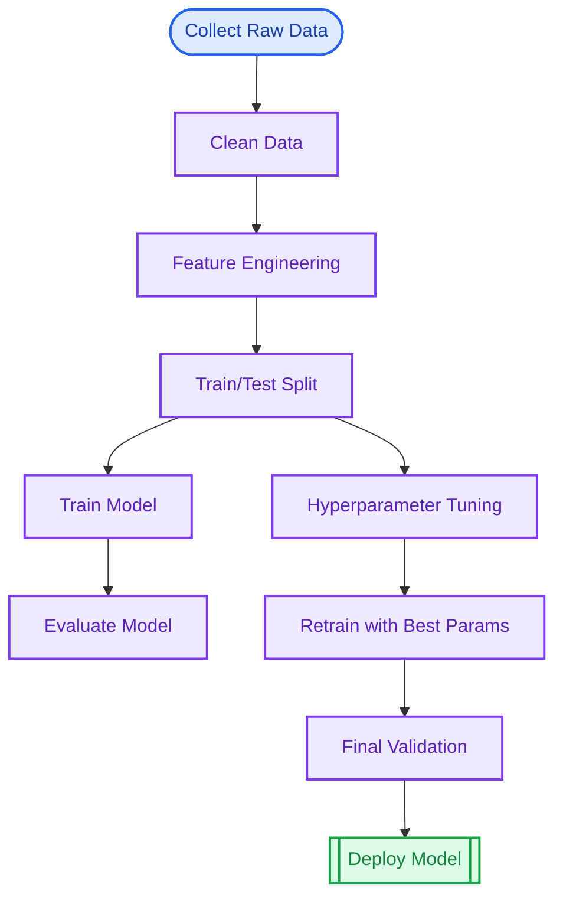
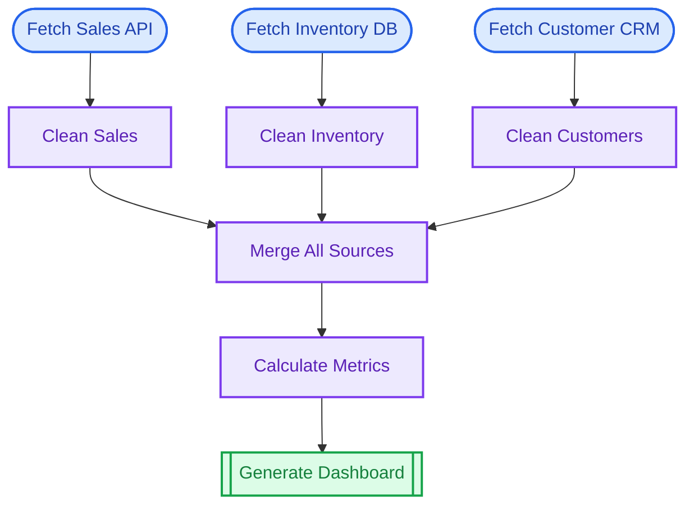
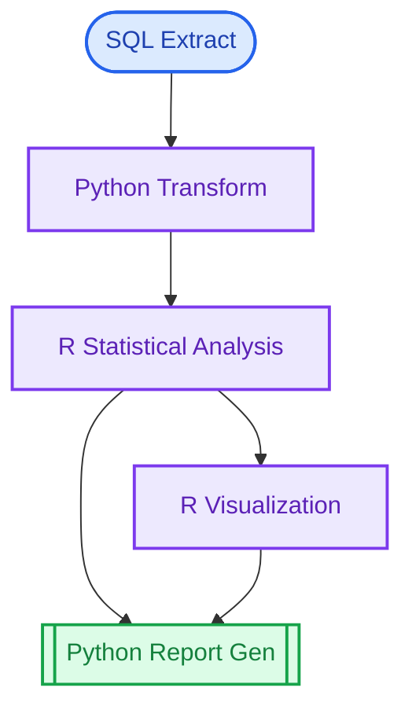
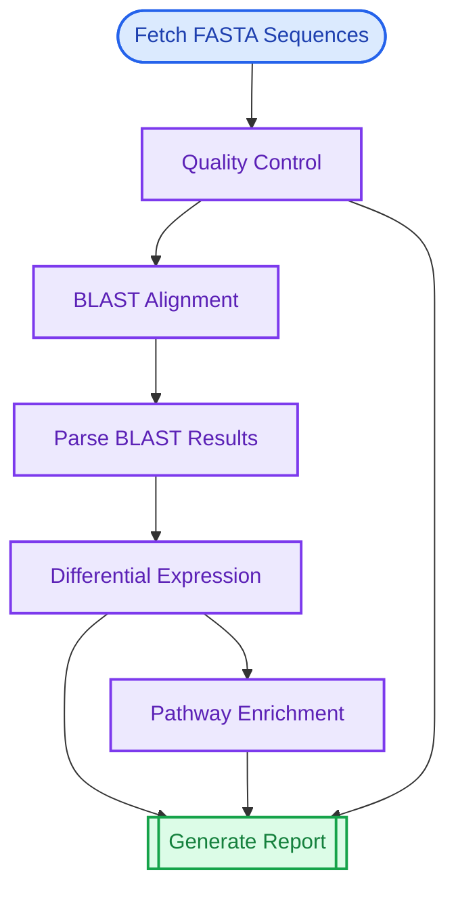
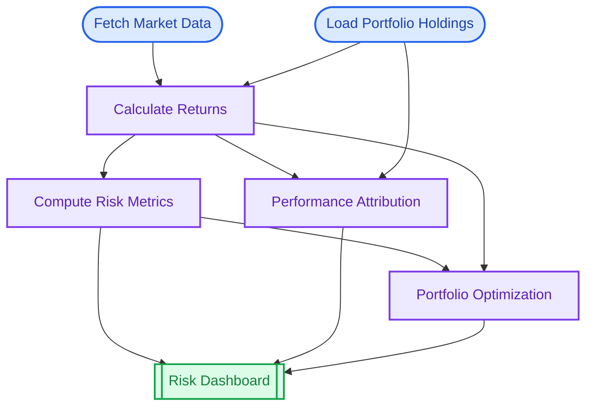
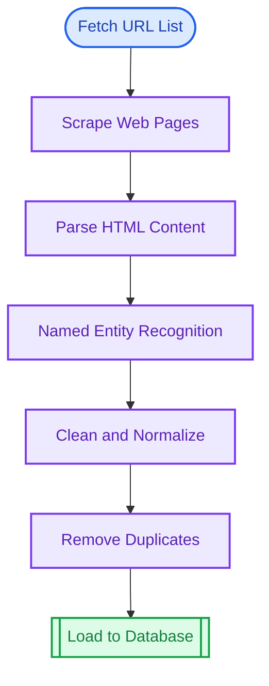
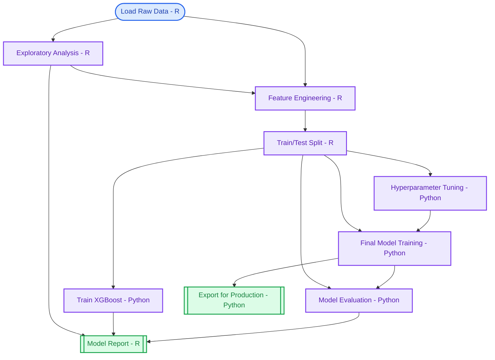

```{r, include = FALSE}
knitr::opts_chunk$set(
  collapse = TRUE,
  comment = "#>",
  eval = FALSE
)
```

This showcase demonstrates putior diagrams at different scales, from simple workflows to complex multi-file pipelines.

## Small Workflows (3-5 nodes)

Perfect for single-purpose scripts or focused analysis tasks.

### Example: Simple ETL Pipeline

A basic extract-transform-load workflow:

```r
# 01_extract.R
#put label:"Extract Data", node_type:"input", output:"raw_data.csv"

# 02_transform.R
#put label:"Transform Data", input:"raw_data.csv", output:"clean_data.csv"

# 03_load.R
#put label:"Load to Database", node_type:"output", input:"clean_data.csv"
```

**Generated Diagram:**


### Example: Report Generation

A simple report generation workflow:

```r
# fetch_metrics.R
#put label:"Fetch Metrics", node_type:"input", output:"metrics.json"

# analyze.R
#put label:"Analyze Trends", input:"metrics.json", output:"analysis.rds"

# report.R
#put label:"Generate Report", node_type:"output", input:"analysis.rds", output:"report.html"
```

**Generated Diagram:**


## Medium Workflows (10-15 nodes)

Suitable for typical data science projects with multiple processing stages.

### Example: Machine Learning Pipeline

A complete ML workflow from data collection to model deployment:

```r
# 01_collect_data.py
#put label:"Collect Raw Data", node_type:"input", output:"raw_data.csv"

# 02_clean_data.R
#put label:"Clean Data", input:"raw_data.csv", output:"clean_data.csv"

# 03_feature_eng.R
#put label:"Feature Engineering", input:"clean_data.csv", output:"features.csv"

# 04_split_data.R
#put label:"Train/Test Split", input:"features.csv", output:"train.csv, test.csv"

# 05_train_model.py
#put label:"Train Model", input:"train.csv", output:"model.pkl"

# 06_evaluate.py
#put label:"Evaluate Model", input:"model.pkl, test.csv", output:"metrics.json"

# 07_hyperparameter.py
#put label:"Hyperparameter Tuning", input:"train.csv", output:"best_params.json"

# 08_retrain.py
#put label:"Retrain with Best Params", input:"train.csv, best_params.json", output:"final_model.pkl"

# 09_validate.R
#put label:"Final Validation", input:"final_model.pkl, test.csv", output:"validation_report.html"

# 10_deploy.sh
#put label:"Deploy Model", node_type:"output", input:"final_model.pkl, validation_report.html"
```

**Generated Diagram:**


### Example: Multi-Source Data Integration

Combining data from multiple sources:

```r
# sources/fetch_sales.R
#put label:"Fetch Sales API", node_type:"input", output:"sales_raw.json"

# sources/fetch_inventory.R
#put label:"Fetch Inventory DB", node_type:"input", output:"inventory_raw.csv"

# sources/fetch_customers.py
#put label:"Fetch Customer CRM", node_type:"input", output:"customers_raw.csv"

# transform/clean_sales.R
#put label:"Clean Sales", input:"sales_raw.json", output:"sales_clean.csv"

# transform/clean_inventory.R
#put label:"Clean Inventory", input:"inventory_raw.csv", output:"inventory_clean.csv"

# transform/clean_customers.R
#put label:"Clean Customers", input:"customers_raw.csv", output:"customers_clean.csv"

# integrate/merge_data.R
#put label:"Merge All Sources", input:"sales_clean.csv, inventory_clean.csv, customers_clean.csv", output:"integrated_data.csv"

# analyze/business_metrics.R
#put label:"Calculate Metrics", input:"integrated_data.csv", output:"metrics.rds"

# report/dashboard.R
#put label:"Generate Dashboard", node_type:"output", input:"metrics.rds", output:"dashboard.html"
```

**Generated Diagram:**


## Large Workflows (20+ nodes)

For enterprise-scale data pipelines and complex analysis systems.

### Example: Complete Analytics Platform

A full analytics platform with multiple parallel processing streams:


## Multi-Language Workflows

putior excels at documenting polyglot data pipelines.

### Example: R + Python + SQL Pipeline

```r
# extract.sql
#put label:"SQL Extract", node_type:"input", output:"raw_query_results.csv"

# transform.py
#put label:"Python Transform", input:"raw_query_results.csv", output:"transformed.parquet"

# analyze.R
#put label:"R Statistical Analysis", input:"transformed.parquet", output:"stats.rds"

# visualize.R
#put label:"R Visualization", input:"stats.rds", output:"plots.pdf"

# report.py
#put label:"Python Report Gen", node_type:"output", input:"stats.rds, plots.pdf", output:"final_report.html"
```

**Generated Diagram:**


## Domain-Specific Examples

Real-world workflows from various data science domains.

### Bioinformatics Pipeline

A genomics analysis workflow processing FASTA sequences:

```r
# sequences/fetch_sequences.R
#put label:"Fetch FASTA Sequences", node_type:"input", output:"raw_sequences.fasta"

# sequences/quality_control.py
#put label:"Quality Control", input:"raw_sequences.fasta", output:"filtered_sequences.fasta, qc_report.html"

# alignment/run_blast.sh
#put label:"BLAST Alignment", input:"filtered_sequences.fasta", output:"blast_results.xml"

# alignment/parse_blast.R
#put label:"Parse BLAST Results", input:"blast_results.xml", output:"alignments.csv"

# analysis/differential_expression.R
#put label:"Differential Expression", input:"alignments.csv", output:"de_results.rds"

# analysis/pathway_analysis.R
#put label:"Pathway Enrichment", input:"de_results.rds", output:"pathways.csv"

# report/bioinformatics_report.R
#put label:"Generate Report", node_type:"output", input:"de_results.rds, pathways.csv, qc_report.html", output:"analysis_report.html"
```

**Generated Diagram:**


### Financial Analysis Pipeline

Portfolio analysis and risk assessment workflow:

```r
# data/fetch_market_data.py
#put label:"Fetch Market Data", node_type:"input", output:"market_prices.parquet"

# data/fetch_holdings.R
#put label:"Load Portfolio Holdings", node_type:"input", output:"holdings.csv"

# analysis/calculate_returns.R
#put label:"Calculate Returns", input:"market_prices.parquet, holdings.csv", output:"returns.rds"

# analysis/risk_metrics.R
#put label:"Compute Risk Metrics", input:"returns.rds", output:"var_results.rds, sharpe_ratios.csv"

# analysis/attribution.py
#put label:"Performance Attribution", input:"returns.rds, holdings.csv", output:"attribution.json"

# optimization/portfolio_optimize.R
#put label:"Portfolio Optimization", input:"returns.rds, var_results.rds", output:"optimal_weights.csv"

# report/risk_dashboard.R
#put label:"Risk Dashboard", node_type:"output", input:"var_results.rds, sharpe_ratios.csv, attribution.json, optimal_weights.csv", output:"risk_report.html"
```

**Generated Diagram:**


### Web Scraping Pipeline

Data extraction from web sources:

```r
# scrape/fetch_urls.py
#put label:"Fetch URL List", node_type:"input", output:"target_urls.txt"

# scrape/scrape_pages.py
#put label:"Scrape Web Pages", input:"target_urls.txt", output:"raw_html.json"

# extract/parse_html.py
#put label:"Parse HTML Content", input:"raw_html.json", output:"extracted_text.json"

# extract/extract_entities.py
#put label:"Named Entity Recognition", input:"extracted_text.json", output:"entities.csv"

# transform/clean_data.R
#put label:"Clean and Normalize", input:"entities.csv", output:"clean_entities.csv"

# transform/deduplicate.R
#put label:"Remove Duplicates", input:"clean_entities.csv", output:"unique_entities.csv"

# load/save_to_db.py
#put label:"Load to Database", node_type:"output", input:"unique_entities.csv"
```

**Generated Diagram:**


### Multi-Language ML Pipeline

A realistic ML workflow using R for data prep, Python for training, and R for reporting:

```r
# data/load_raw_data.R
#put label:"Load Raw Data (R)", node_type:"input", output:"raw_data.rds"

# data/eda_analysis.R
#put label:"Exploratory Analysis (R)", input:"raw_data.rds", output:"eda_report.html, data_summary.json"

# preprocessing/feature_engineering.R
#put label:"Feature Engineering (R)", input:"raw_data.rds, data_summary.json", output:"features.parquet"

# preprocessing/split_data.R
#put label:"Train/Test Split (R)", input:"features.parquet", output:"train.parquet, test.parquet"

# training/train_model.py
#put label:"Train XGBoost (Python)", input:"train.parquet", output:"model.pkl, training_metrics.json"

# training/hyperparameter_search.py
#put label:"Hyperparameter Tuning (Python)", input:"train.parquet", output:"best_params.json"

# training/final_model.py
#put label:"Final Model Training (Python)", input:"train.parquet, best_params.json", output:"final_model.pkl"

# evaluation/model_evaluation.py
#put label:"Model Evaluation (Python)", input:"final_model.pkl, test.parquet", output:"predictions.csv, eval_metrics.json"

# reporting/model_report.R
#put label:"Model Report (R)", node_type:"output", input:"eval_metrics.json, training_metrics.json, eda_report.html", output:"final_report.html"

# deployment/export_model.py
#put label:"Export for Production (Python)", node_type:"output", input:"final_model.pkl", output:"model_artifact.tar.gz"
```

**Generated Diagram:**


This example demonstrates:
- **R for data handling**: Loading, EDA, feature engineering, splitting
- **Python for ML**: XGBoost training, hyperparameter search, evaluation
- **R for reporting**: Combining results into a final report
- **Python for deployment**: Packaging model artifacts

---

## Tips for Large Workflows

When working with complex workflows:

1. **Use meaningful IDs**: Choose IDs that reflect the step's purpose
2. **Group related files**: Organize scripts into subdirectories
3. **Use subgraphs**: Group related nodes with `show_source_info = TRUE, source_info_style = "subgraph"`
4. **Consider direction**: Use `direction = "LR"` for wide workflows, `direction = "TD"` for deep ones
5. **Show artifacts selectively**: Use `show_artifacts = TRUE` only when data lineage matters

```r
# For large workflows, consider:
put_diagram(workflow,
  direction = "LR",              # Left-to-right for wide pipelines
  show_source_info = TRUE,       # Show file names
  source_info_style = "subgraph",# Group by file
  theme = "minimal"              # Clean look for complex diagrams
)
```

## Try It Yourself

Run the built-in examples:

```{r eval=FALSE}
# Basic example
source(system.file("examples", "reprex.R", package = "putior"))

# Data science workflow
source(system.file("examples", "data-science-workflow.R", package = "putior"))

# Self-documentation (putior documents itself!)
source(system.file("examples", "self-documentation.R", package = "putior"))
```
