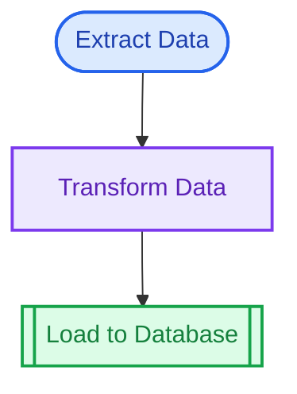
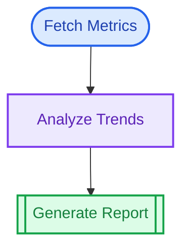
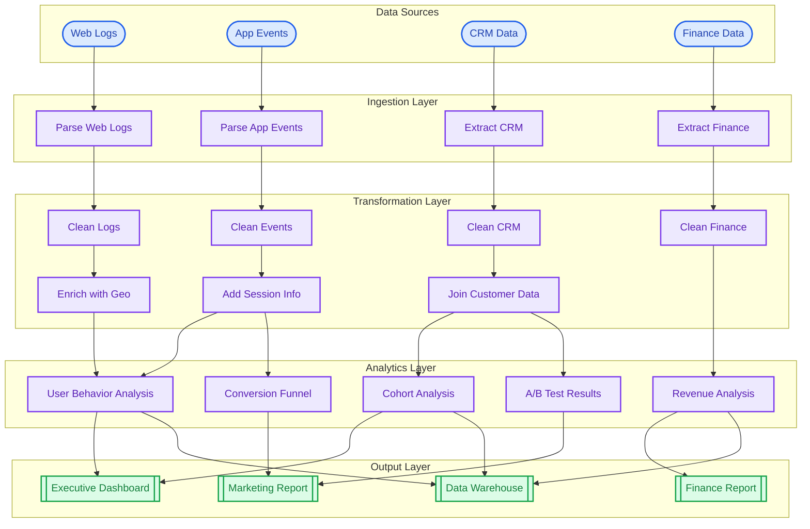

```{r, include = FALSE}
knitr::opts_chunk$set(
  collapse = TRUE,
  comment = "#>",
  eval = FALSE
)
```

This showcase demonstrates putior diagrams at different scales, from simple workflows to complex multi-file pipelines.

## Small Workflows (3-5 nodes)

Perfect for single-purpose scripts or focused analysis tasks.

### Example: Simple ETL Pipeline

A basic extract-transform-load workflow:

```r
# 01_extract.R
#put label:"Extract Data", node_type:"input", output:"raw_data.csv"

# 02_transform.R
#put label:"Transform Data", input:"raw_data.csv", output:"clean_data.csv"

# 03_load.R
#put label:"Load to Database", node_type:"output", input:"clean_data.csv"
```

**Generated Diagram:**


### Example: Report Generation

A simple report generation workflow:

```r
# fetch_metrics.R
#put label:"Fetch Metrics", node_type:"input", output:"metrics.json"

# analyze.R
#put label:"Analyze Trends", input:"metrics.json", output:"analysis.rds"

# report.R
#put label:"Generate Report", node_type:"output", input:"analysis.rds", output:"report.html"
```

**Generated Diagram:**


## Medium Workflows (10-15 nodes)

Suitable for typical data science projects with multiple processing stages.

### Example: Machine Learning Pipeline

A complete ML workflow from data collection to model deployment:

```r
# 01_collect_data.py
#put label:"Collect Raw Data", node_type:"input", output:"raw_data.csv"

# 02_clean_data.R
#put label:"Clean Data", input:"raw_data.csv", output:"clean_data.csv"

# 03_feature_eng.R
#put label:"Feature Engineering", input:"clean_data.csv", output:"features.csv"

# 04_split_data.R
#put label:"Train/Test Split", input:"features.csv", output:"train.csv, test.csv"

# 05_train_model.py
#put label:"Train Model", input:"train.csv", output:"model.pkl"

# 06_evaluate.py
#put label:"Evaluate Model", input:"model.pkl, test.csv", output:"metrics.json"

# 07_hyperparameter.py
#put label:"Hyperparameter Tuning", input:"train.csv", output:"best_params.json"

# 08_retrain.py
#put label:"Retrain with Best Params", input:"train.csv, best_params.json", output:"final_model.pkl"

# 09_validate.R
#put label:"Final Validation", input:"final_model.pkl, test.csv", output:"validation_report.html"

# 10_deploy.sh
#put label:"Deploy Model", node_type:"output", input:"final_model.pkl, validation_report.html"
```

**Generated Diagram:**


### Example: Multi-Source Data Integration

Combining data from multiple sources:

```r
# sources/fetch_sales.R
#put label:"Fetch Sales API", node_type:"input", output:"sales_raw.json"

# sources/fetch_inventory.R
#put label:"Fetch Inventory DB", node_type:"input", output:"inventory_raw.csv"

# sources/fetch_customers.py
#put label:"Fetch Customer CRM", node_type:"input", output:"customers_raw.csv"

# transform/clean_sales.R
#put label:"Clean Sales", input:"sales_raw.json", output:"sales_clean.csv"

# transform/clean_inventory.R
#put label:"Clean Inventory", input:"inventory_raw.csv", output:"inventory_clean.csv"

# transform/clean_customers.R
#put label:"Clean Customers", input:"customers_raw.csv", output:"customers_clean.csv"

# integrate/merge_data.R
#put label:"Merge All Sources", input:"sales_clean.csv, inventory_clean.csv, customers_clean.csv", output:"integrated_data.csv"

# analyze/business_metrics.R
#put label:"Calculate Metrics", input:"integrated_data.csv", output:"metrics.rds"

# report/dashboard.R
#put label:"Generate Dashboard", node_type:"output", input:"metrics.rds", output:"dashboard.html"
```

**Generated Diagram:**


## Large Workflows (20+ nodes)

For enterprise-scale data pipelines and complex analysis systems.

### Example: Complete Analytics Platform

A full analytics platform with multiple parallel processing streams:



## Multi-Language Workflows

putior excels at documenting polyglot data pipelines.

### Example: R + Python + SQL Pipeline

```r
# extract.sql
#put label:"SQL Extract", node_type:"input", output:"raw_query_results.csv"

# transform.py
#put label:"Python Transform", input:"raw_query_results.csv", output:"transformed.parquet"

# analyze.R
#put label:"R Statistical Analysis", input:"transformed.parquet", output:"stats.rds"

# visualize.R
#put label:"R Visualization", input:"stats.rds", output:"plots.pdf"

# report.py
#put label:"Python Report Gen", node_type:"output", input:"stats.rds, plots.pdf", output:"final_report.html"
```

**Generated Diagram:**


## Tips for Large Workflows

When working with complex workflows:

1. **Use meaningful IDs**: Choose IDs that reflect the step's purpose
2. **Group related files**: Organize scripts into subdirectories
3. **Use subgraphs**: Group related nodes with `show_source_info = TRUE, source_info_style = "subgraph"`
4. **Consider direction**: Use `direction = "LR"` for wide workflows, `direction = "TD"` for deep ones
5. **Show artifacts selectively**: Use `show_artifacts = TRUE` only when data lineage matters

```r
# For large workflows, consider:
put_diagram(workflow,
  direction = "LR",              # Left-to-right for wide pipelines
  show_source_info = TRUE,       # Show file names
  source_info_style = "subgraph",# Group by file
  theme = "minimal"              # Clean look for complex diagrams
)
```

## Try It Yourself

Run the built-in examples:

```{r eval=FALSE}
# Basic example
source(system.file("examples", "reprex.R", package = "putior"))

# Data science workflow
source(system.file("examples", "data-science-workflow.R", package = "putior"))

# Self-documentation (putior documents itself!)
source(system.file("examples", "self-documentation.R", package = "putior"))
```
